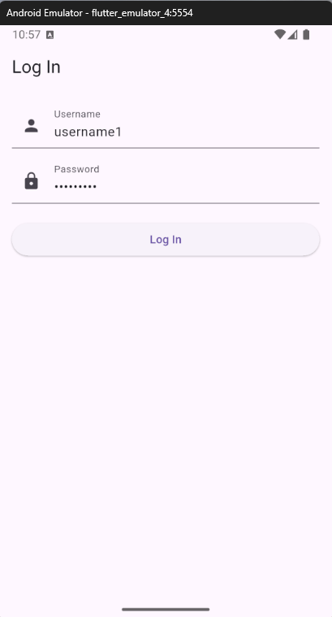
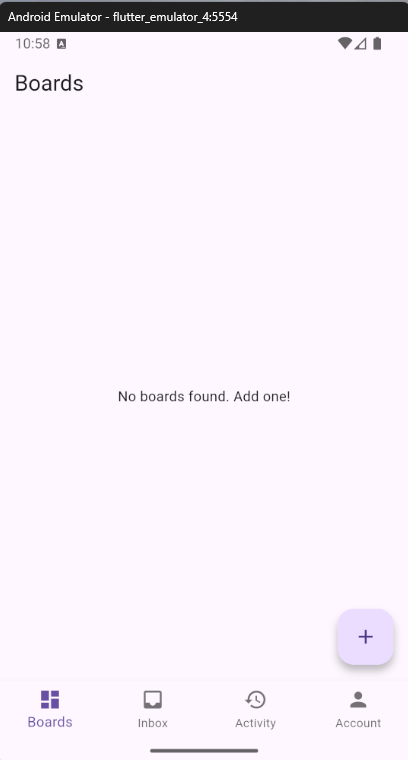
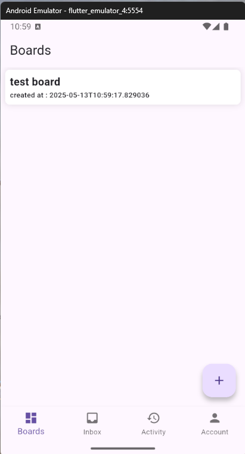
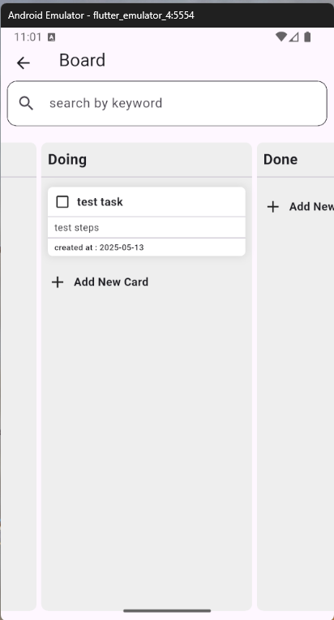
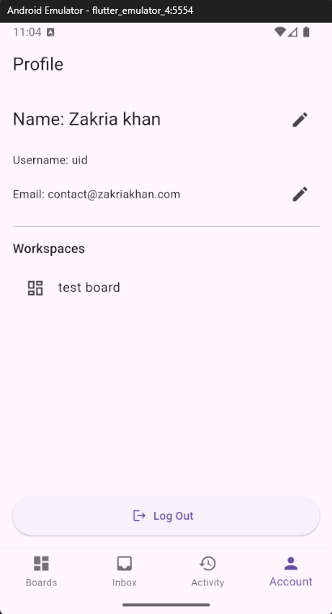
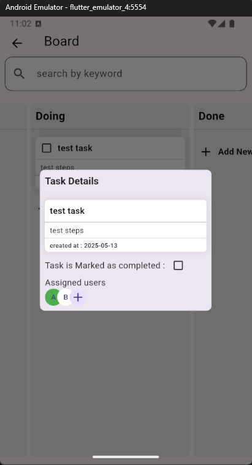

# Challenge 1 Group 3

A cross-platform Flutter application for team collaboration and project management, inspired by platforms like Trello.

---

## About the App

This Teamwork Platform App allows users to:
- Create and manage boards, lists, and tasks (cards)
- Collaborate with team members in real time
- Track project progress visually
- Organize workspaces for different projects or teams

## Table of Contents
- [Project Structure](#project-structure)
- [Configuration](#configuration)
- [Running the App](#running-the-app)
- [Screenshots](#screenshots)
- [Contact](#contact)

---

## Project Structure

```
challenge_1_group3/
│
├── lib/               # Main Dart source files
│   ├── main.dart      # App entry point
│   ├── models/        # Data models
│   ├── provider/      # State management providers
│   ├── services/      # Business logic & services
│   ├── styling/       # Theme and styling
│   └── ui/            # UI components
│       ├── pages/     # App screens (login, board, home, etc.)
│       └── widgets/   # Reusable widgets
├── test/              # Unit and widget tests
├── screen_shots/      # Place your screenshots here
├── pubspec.yaml       # Flutter/Dart dependencies
└── README.md          # Project documentation
```

---

## Configuration

1. **Install Flutter:**
   - Follow the official guide: https://docs.flutter.dev/get-started/install
2. **Clone the repository:**
   ```sh
   git clone https://github.com/cyclone-pk/challenge_1_group3.git
   cd challenge_1_group3
   ```
3. **Get dependencies:**
   ```sh
   flutter pub get
   ```

---

## Running the App

1. **Run on mobile (Android/iOS):**
   - Connect your device or start an emulator/simulator.
   - Run:
     ```sh
     flutter run
     ```
2. **Run on desktop (Windows/macOS/Linux):**
   - Ensure your platform is supported by Flutter.
   - Run:
     ```sh
     flutter run -d <windows|macos|linux>
     ```
3. **Run on web:**
   - Run:
     ```sh
     flutter run -d chrome
     ```

---

## Screenshots

Below are some screenshots demonstrating the main features and UI of the Teamwork Platform App:

### Login Screen


### Home Page


### Home Page (Boards Overview)


### Board Page


### Account Page


### Task Details


---

## Contact
For questions or support, please contact the project maintainers.